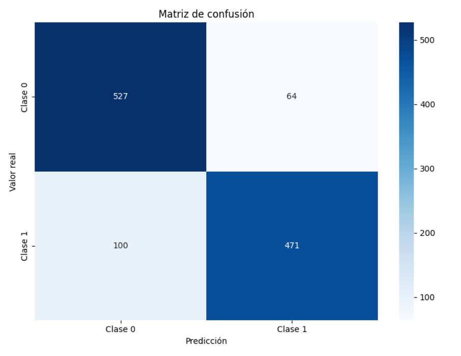
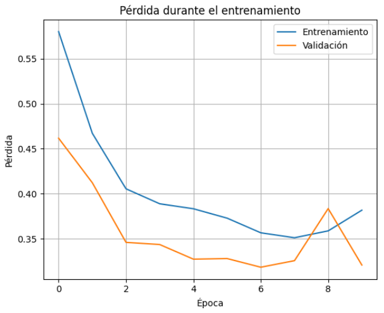
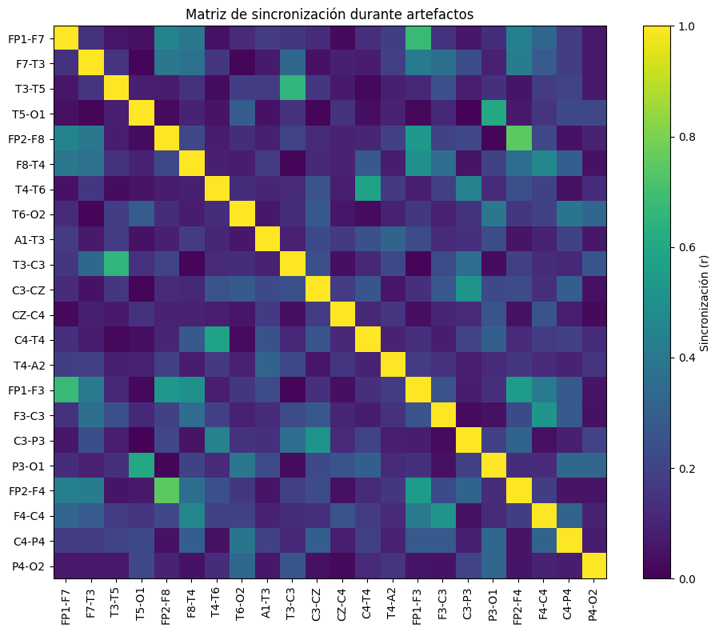

# EEG_procesing
In this work we trained an AI to recognize artifacts in electroencephalograms (EEG) and search for synchronization in the brain through the Kuramoto model.

An electroencephalogram (EEG) is a measurement of brain activity that consists of 24 electrodes placed around the head, where each electrode measures the electrical activity in its region. The difference between two electrodes is called a "channel," which is also a time series. The problem is that during EEG recording, there are measurement "errors" due to involuntary patient movements, such as eye blinks, eye movements, masseter muscle movement, etc. These errors are called "artifacts," and it requires an experienced doctor to detect artifacts in an EEG. Because of this, we decided to develop an AI that can detect them automatically.

For this work, we obtained a very large database containing hundreds of EEGs with more than 1,400 seconds of measurement each, with artifacts marked by a qualified doctor. The first step was to match, normalize, and clean the data. We then chose a Long Short-Term Memory (LSTM) as our neural network and used Optuna to optimize our hyperparameters during the neural network training, achieving the following performance:

 

Additionally, we used the Kuramoto model to conduct a brief analysis looking for synchronization between channels to track impulses throughout the brain during artifacts, but we didn't find anything relevant.

 
